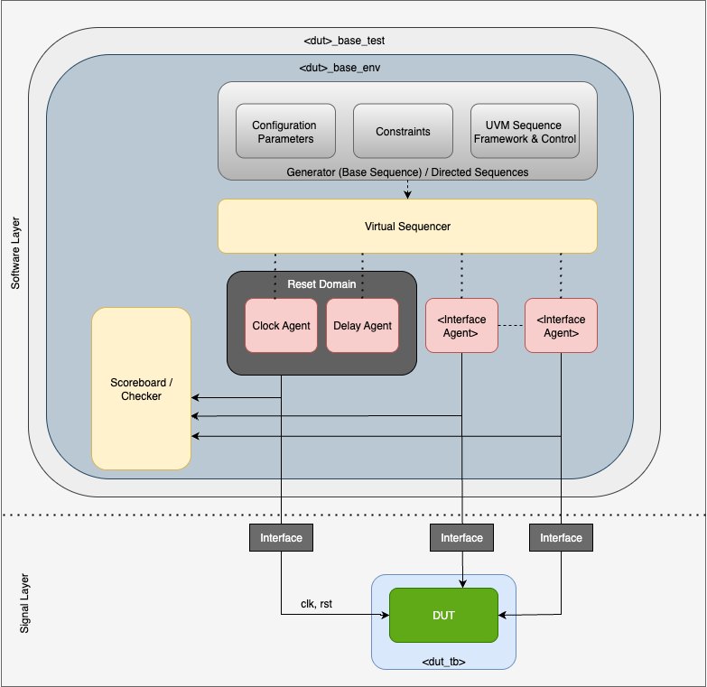
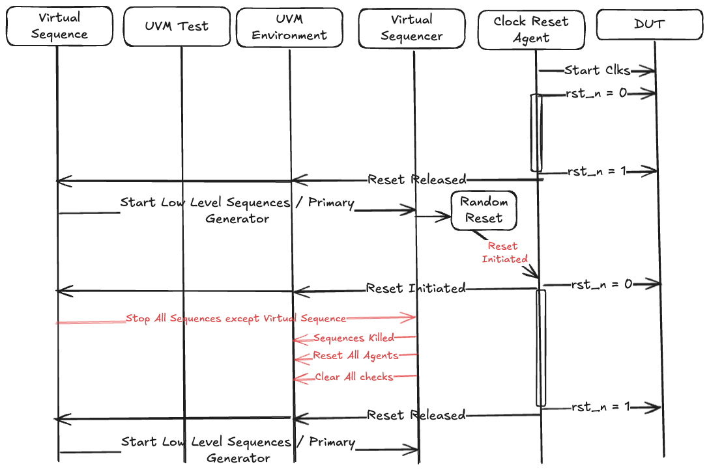

# Building Scalable System Verilog UVM Infrastructure for Open Silicon IP's

# Introduction

Universal Verification Methodology (UVM) is a standardized framework for verifying digital hardware designs (IEEE-1800.2.2020).
It's built on object-oriented programming (OOP) principles and promotes reusable, scalable verification environments.
UVM is widely used in the semiconductor industry for functional verification of ASICs, FPGAs, and SoCs.
It helps to improve the resilience of the design under test (DUT) by using controlled stimuli and scoreboarding responses with expected values.

### Why UVM?

UVM is not a language—it's a library of base classes and macros developed in SystemVerilog (IEEE-1800-2017); a language specialized for digital design and development. [^1]

UVM provides a modular architecture to separate concerns like stimulus generation, monitoring, and scoreboarding.
This modularity allows teams to build configurable verification environments (Structural/Dynamic) and reuse them across many different IP's/projects with the focus on reducing time and effort for verification.
Maintainability in the testbenches comes not from language features but from discipline: strict coding style and modular structure.

In this post we shall explore the verification methodology for building testbenches using Universal Verification Methodology (UVM) in SystemVerilog (SV) with an emphasis on modularity, stimulus layering, and a structured flow for stimulus activation.

The post is divided into the following sections:

1. Building UVM-based testbenches.
2. Layering stimulus to help reuse across multiple levels
3. Stimulus activation flow from reset in the base sequence to the execution of constrained random or directed tests.
4. Rules for collection of data for metrics and coverage

This approach ensures efficient verification of RTL designs (DUT \- Device Under Test) by promoting reuse, randomization, and coverage-driven testing.

# Building UVM-Based Testbenches

UVM testbenches are constructed as hierarchical class-based environments that separate concerns such as stimulus generation, monitoring, checking, and coverage collection. The core philosophy is to use factory patterns, phases, and components for configurability and extensibility.

## Structural Elements of the Testbench

Structural elements are derived from uvm\_component and persist throughout the test's lifecycle, typically held until the end of the test.
These components form the static framework of the testbench.


| UVM Object Type | Description |
| :---- | :---- |
| UVM Test | The top-level class that instantiates the environment and configures the test scenario. It extends uvm\_test and defines the build\_phase(), run\_phase(), etc., to set up and execute tests. |
| UVM Environment (uvm\_env) | A container for agents, scoreboards, and other sub-environments. It manages the overall testbench architecture/structure. |
| UVM Agent (uvm\_agent)  | Encapsulates drivers, sequencers, and monitors for a specific interface. Agents can be active (with driver and sequencer) or passive (monitor only). |
| UVM Driver (uvm\_driver)  | Drives signals to the DUT via virtual interfaces. |
| UVM Sequencer (uvm\_sequencer) | Manages execution sequences of sequences and provides the necessary connection between sequences (transaction generator) and the driver. |
| UVM Monitor (uvm\_monitor) | Observes DUT signals on a specific interface and collects data for analysis. |
| UVM Scoreboard (uvm\_scoreboard) | Compares expected vs. actual behavior using reference models. |
| UVM Virtual Sequencer  | Coordinates multiple sequencers for complex scenarios. |

## Dynamic Elements of the Testbench

Dynamic elements are derived from uvm\_object such as 'uvm\_sequence\_item' and can be created or destroyed as needed during the test execution. These elements are typically transient and used to generate or manipulate stimulus and behavior.

| Element Type | Description |
| :---- | :---- |
| Sequences and Sequence Items | Define stimulus as transactions (e.g., extending uvm\_sequence\_item and uvm\_sequence). |
| Reference Model   | A golden model that predicts DUT behavior. (eg. Crypto Model in C/C++, PQC, Etc) |
| Assertions | Immediate or concurrent checks for protocol violations. (Typically seen in the signal layer) |
| Configurations | Static or runtime parameterization to get the DUT into one of its legal states of operation. |
| Callbacks | Provides a mechanism to get feedback into active elements and allow the sequence to be reactive to the state of the DUT when certain scenarios are observed. |

# Layering in UVM


The provided diagram illustrates a layered architecture for stimulus generation and verification, aligning closely with UVM's hierarchical approach. Stimulus is abstracted from high-level scenarios down to low-level signals, promoting reuse and scalability.

The layers are:

| Layer | Use |
| :---- | :---- |
| Application/Test Layer | High-level tests and constraints, with callbacks for customization. |
| Scenario Layer | Sequences that define scenario flows. |
| Transaction Layer | Transaction generators, virtual sequencers, reference models, and scoreboards. |
| Command Layer  | Drivers, monitors, assertions for interface-level commands. |
| Signal/Temporal Layer | Direct interaction with the DUT (RTL/Design).On the DV side elements of the drivers and monitors can be synthesised so as to allow the DV framework to work on FPGAs / Emulation |

## Stimulus Layering

Stimulus starts at the abstract level and is progressively refined downward. Downward arrows represent stimulus propagation (tests → sequences → transactions → commands → signals). Upward/feedback arrows show monitoring and checking (monitors → scoreboard or monitors → sequences (using callbacks)).

This layering ensures stimulus is reusable: e.g., a sequence can be reused across tests by overriding constraints.

### Application/Test Layer:

| Objective | Description |
| :---- | :---- |
| Role | Defines test cases, constraints, and overall control. |
| UVM Mapping | Test Parameters and Config Parameter classes (derived from uvm\_object) apply constraints to randomize scenarios. Callbacks allow injection of custom behavior based on RTL's state, such as error insertion or logging. |
| Stimulus Flow | Tests configure the environment and start base sequences on sequencers.  |

### Scenario Layer:

| Objective | Description |
| :---- | :---- |
| Role | Selection of real world scenarios that can be activated in serial or in parallel. Sequences can contain multiple transactions to model real-world scenarios. |
| UVM Mapping | uvm\_sequence classes (e.g., base\_sequence, virtual\_sequence) define ordered or parallel flows. |
| Stimulus Flow | Complex high level sequences can initiate many simple low level sequences to work in serial or in parallel (synchronous / asynchronous) to activate the design to operate in a configuration of legal space.  |

### Transaction Layer:

| Objective | Description |
| :---- | :---- |
| Role | Generates and processes transactions; includes prediction and checking. |
| UVM Mapping | uvm\_sequence classes Transaction Generator : Sequences that actively generate items to send to the command layer. Virtual Sequencer / Sequencers : uvm\_virtual\_sequencer coordinates multiple uvm\_sequencer for multi-interface stimulus. Reference Model : A functional model (e.g., C++ or SV) that predicts outputs. Scoreboard / Checker : compares actual vs. expected. |
| Stimulus Flow | Transactions are sequenced, forked to reference model, and driven downward. |

### Command Layer:

| Objective | Description |
| :---- | :---- |
| Role | Translates transactions to pin-level commands and monitors responses. |
| UVM Mapping | Interface Drivers : uvm\_driver converts transactions to signal wiggles. Input/Output Monitors: uvm\_monitor collects signals into transactions. Assertions : SVA (SystemVerilog Assertions) for temporal checks. |
| Stimulus Flow | Drivers apply commands to DUT; monitors provide feedback to higher layers. |

### Signal/Temporal Layer:

| Objective | Description |
| :---- | :---- |
| Role | Lowest level, handling signals and timing. |
| UVM Mapping | Virtual interfaces connect to the DUT. Clocking blocks and modports ensure temporal accuracy. |
| Stimulus Flow | Driver side: Signal application to RTL Monitor Side: Response reconstruction as command / transactions Assertion Side: Interface protocol checks, timing checks |

# Reset Domains

What is a ‘Reset Domain’?  It is a region of the design that shares a common reset signal. Modern SoCs typically have multiple reset domains because:

* Different IP blocks may have independent reset requirements
* Power management creates domains that can be reset separately
* Clock domain crossings often align with reset domain boundaries
* Asynchronous resets vs. synchronous resets create natural partitions
* Functional reset (soft reset) vs. hard reset scenarios

Why Reset Domains Matter in Verification?

* Ordering Issues: If a testbench doesn't respect reset domain relationships i.e start driving transactions before a block is out of reset; it creates false failures when checking interfaces across reset boundaries and can miss real bugs related to reset sequencing
* Coverage Gaps: Different reset scenarios (cold boot, warm reset, selective domain resets) exercise different logic paths
* Real-World Scenarios: Systems rarely reset everything simultaneously in the field

#

# Generic Stimulus Flow in Standard UVM

The stimulus generation in UVM follows a hierarchical path through several key phases and components.  When ‘run\_test()’ is called in the initial block of the testbench module, UVM factory creates an instance of uvm\_test (or derived test class) and initiates the ‘build\_phase()’, propagating top-down through the hierarchy and building the static elements (env, agents, sequencers, drivers, and monitors). ‘run\_phase()’ initiates the execution of the main sequence on the virtual sequencer which in turn will invoke the ‘body()’ task of the sequence to start the execution of user defined stimulus.

```
1. Create Test Instance
    ↓
2. Call run_test() at the end of an initial block
    ↓
3. Build Phase : creates structural elements: test, env, agent, sequencer,
                 drivers, monitors
    ↓
4. Connect Phase : sequencer ↔ driver, monitor ↔ scorboard,
                   monitor ↔ sequences)
    ↓
5. Run Phase : activate/create desired sequence to run
    ↓
6. Test: start sequence on virtual sequencer
    ↓
7. Sequence: pre_body()
    ↓
8. Sequence: body() : User defined stimulus logic - individual transaction
                      level / multi sequence level
    ↓
    8a. start_item(req) → Arbitration → Wait for driver → Driver locked to
                                                            sequence
    ↓
    8b. randomize(req)
    ↓
    8c. finish_item(req) → Send to sequencer → Forward to driver
    ↓
9.  Driver: get_next_item() receives transaction
    ↓
10. Driver: drives signals on DUT interface
    ↓
11. Driver: item_done() signals completion
    ↓
12. Sequence: continues or completes - Go back to step 8 if more transactions
                                       are needed
    ↓
13. post_body()
    ↓
14. post_start()
    ↓
15. terminate
```

Over the years UVM has helped build a level of consistency and discipline in verification by ensuring organized, reusable, and configurable stimulus generation in UVM testbenches.
Key advantages in the native flow are:

* Separation of Concerns: Stimulus generation (sequence) is decoupled from signal-level driving (driver), enabling independent development.
* Reusability: Sequences can run on any compatible sequencer without modification; drivers can work with different sequences
* Layered Abstraction: Transaction-level modeling abstracts away timing details, making test writing more intuitive
* Arbitration Support: Built-in mechanism handles multiple sequences competing for driver access
* Configurability: Factory pattern allows runtime override of sequences/components without code changes
* Standardization: Industry-standard methodology improves code readability and team collaboration

But native UVM has its inherent limitations too:

* Complexity : Steep learning curve with heavy infrastructure (phases, factory, TLM) \- overkill for simple testbenches
* Overhead: Multiple abstraction layers and phase execution add simulation performance overhead
* Debugging Difficulty: Deep call stacks and macro-heavy code make debugging harder; stimulus flow is non-obvious to beginners
* Rigid Structure: The prescribed hierarchy and phase ordering can be constraining for non-standard verification scenarios (Asynchronous events such as Interrupts, Error Conditions, Error Injection, Resets, Clock Domains, etc)

UVM excels for large, complex projects with multiple engineers where reusability and standardization justify the overhead.
For small projects, the complexity may outweigh the benefits.

## Reset Handling Challenges in UVM

The native UVM stimulus generation process has inherent weaknesses when dealing with resets.
The core issue here is that UVM is designed for transaction-level stimulus generation with the assumption of continuous forward progress.

### What is "Continuous Forward Progress"?

Continuous forward progress means the verification environment assumes uninterrupted execution flow i.e. once a sequence execution / transaction starts, it will complete.
It also means simulation moves forward without any state rollbacks by having persistent state i.e. component states (sequencer queues, driver FSMs, scoreboards) remain valid throughout operation This model path i.e stimulus flows smoothly from sequence to sequencer to driver to DUT, works  without interruption or feedback.

What UVM Expects (Continuous Progress):

```
Transaction N: start → randomize → finish → item_done ✓
Transaction N+1: start → randomize → finish → item_done ✓
Transaction N+2: start → randomize → finish → item_done ✓
... continuous, uninterrupted flow ...
```

What Actually Happens (Reset Interruption):

```
Transaction N: start → randomize → finish → item_done ✓
Transaction N+1: start → randomize → finish → [RESET] → ???
                                              ↑
                                      Everything breaks here
```

### Fundamental Issue

Resets violate continuous forward progress assumption by:

* Breaking handshaking contracts (item\_done may never arrive)
* Invalidating in-flight state
* Requiring immediate, non-phased response

This is an architectural mismatch between UVM's synchronized, phase-based model and the asynchronous, disruptive nature of hardware resets.

Practical Impact: Teams spend significant effort building reset frameworks on top of UVM rather than getting this "for free" \- it's one of the methodology's most criticized shortcomings.

## Handling Asynchronous Resets

When a reset is asserted the design (RTL / DUT) is expected to halt its operations and return its internal states to default state.
Similarly the testbench needs to synchronize with the DUT’s behavior and be able to react appropriately upon detecting the reset.

The acceptable testbench methods for handling the resets are: One \- by utilizing the UVM phasing and phase jumping method.
Second \- is by building reset awareness into UVM testbench components.

UVM guidance did try to address this issue by breaking down the run\_phase() into: reset\_phase(), configure\_phase(), main\_phase(), shutdown\_phase() and allowed phase jumping.
In reality it only complicated testbench development.
To work with UVM phasing methodology one needs to have advanced UVM knowledge and the ability to deep dive into the UVM source code to implement it.

In the rest of this post we will only deal with ‘reset awareness’ in UVM elements and the recommendations presented allow ‘reset safety’ to be front and center of every sequence and scoreboarding capability of any testbench.

### Core Problems

* No Built-in Reset Awareness
  * UVM phases execute linearly without native support for asynchronous events like resets (The body() task doesn't know if/when a reset occurs).
* Sequence-Driver Desynchronization:
  * During reset, the driver must abort current transaction and reinitialize the interface
  * The sequence may still be blocked in finish\_item() waiting for item\_done()
  * Creates a deadlock or orphaned transaction scenario
* State Inconsistency:
  * Sequencer's arbitration state becomes stale
  * Outstanding transactions in TLM FIFOs become invalid
  * Driver's protocol state machine needs reset but sequence is unaware
  * Sequence execution progress will be invalid and the sequence will need to be restarted / terminated

### Specific Technical Issues

* During Active Transaction Processing:

```
// Sequence blocked here when reset hits
finish_item(req);  // Waiting for item_done() that may never come
```

* Driver detects reset and stops driving
  * Never calls item\_done()
  * Sequence hangs indefinitely
* Sequence Pipeline Pollution:
  * Multiple transactions may be start\_item()'ed before reset
  * All become invalid but remain in sequencer's queue
  * No automatic flush mechanism
* Phase Objections:
  * If reset occurs during run\_phase, objections may keep simulation alive
  * Manual objection management needed around reset events

# Reset Aware Stimulus Flow in UVM

"Stop-Clean-Restart" is a framework that has to be employed in UVM when handling asynchronous resets.

* Reset Drive: Only Clock Reset Agent can drive reset signal
* Reset Detection: All static elements of the testbench are reset aware and can detect reset events
* Sequence Control: On reset, all sequences except the Virtual Sequence are immediately terminated.
* Environment Cleanup: On reset, scoreboard and agent persistent state is set to default values
* Restart: After reset deassertion, low-level sequences and the primary generator restart afresh



```
1. Create Test Instance
    ↓
2. Call run_test() at the end of an initial block
    ↓
3. Build Phase : creates structural elements: test, env, agent, sequencer,
                 drivers, monitors
    ↓
4. Connect Phase : sequencer ↔ driver, monitor ↔ scorboard,
                   monitor ↔ sequences)
    ↓
5. Run Phase : activate/create desired sequence to run
    ↓
    5a. Driver : run_phase() is reset aware - two seperate threads -
                 reset_thread and get_and_drive_thread
    ↓
    5b. Driver : Wait for initial reset and start both threads
    ↓
    5c. Driver : When reset is detected get_and_drive() thread is terminated
                 with appropriate TLM handshaking.
    ↓
    5d. Driver : The driver state and the interface is set
                 back to default values.
    ↓
    5e. Driver : get_and_drive() is restarted when reset is deasserted and
                 stable.
    ↓
    5f. Monitor : run_phase() is reset aware - two seperate threads -
                  reset_thread and collect_trans_thread
    ↓
    5g. Monitor : Wait for POR and start both threads. When reset is detected
                  collect_trans() is terminated and the thread is restarted
                  when reset is deasserted and stable.
    ↓
    5h. Agent : run_phase() is reset aware - agent_reset_thread added
    ↓
    5i. Agent : Wait for initial reset and start the agent_reset_thread.
    ↓
    5j. Agent : When reset is detected. Agent will stop all sequences in the
                associated sequencer which are active and get the sequencer to
                a default state unless it is instructed not to do so.
    ↓
6. Test: start sequence on virtual sequencer
    ↓
7. Sequence: pre_body()
    ↓
8. Sequence: body() : Triggers reset, monitors reset, and responds to reset
    ↓
    8a. body() : starts asynchronous 'monitor_reset()' thread. On reset
                 detection sets an internal flag to indicate reset assertion is
                 observed at the DUT.
                 Similarly on reset deassertion will indicate that the DUT is
                 in operational mode.
    ↓
    8b. body() : On release of initial reset, two threads are initiated;
                 trigger_reset_thread() and main_thread()
    ↓
    8c. trigger_reset_thread() : Independent and asynchronous thread.
                                 User defined stimulus logic to randomly
                                 trigger reset. Key contol knobs:
                                 - reset_assertion_delay - time between
                                   assertions
                                 - length_reset_assertion - active time for
                                   reset
    ↓
    8d. main_thread() : User defined stimulus logic - individual transaction
                        level / multi sequence level
    ↓
    8e. main_thread() : start_item(req) → Arbitration → Wait for driver
                        → Driver locked to sequence
    ↓
    8f. main_thread() : randomize(req)
    ↓

    8g. main_thread() : finish_item(req) → Send to sequencer → Forward to
                        driver
    ↓
    8h. main_thread() : continues or completes - Go back to step 8e if more
                        transactions are needed. If completed will move the
                        sequence execution to step 13: Sequence : post_body()
    ↓
9.  Driver: get_next_item() receives transaction
    ↓
10. Driver: drives signals on DUT interface
    ↓
11. Driver: item_done() signals completion
    ↓
12. Sequence: reset_trigger_thread() : Activates reset by running a
                                       reset_sequence on the clk_rst_agent
    ↓
    12a. reset_trigger_thread() : Waits until reset assertion is observed by
                                  the monitor_reset() and relinquishes control
                                  to the body() task
    ↓
    12b. body() : Kill main_thread() and wait till reset is deasserted
                  go back to step 8b to restart the sequence execution after
                  reset event
    ↓
13. Sequence : post_body()
    ↓
14. Sequence : post_start()
    ↓
15. terminate

```

## Recommendations for Reset Safety

### Signal Layer Components: Drivers and Monitors

The run\_phase() for any driver or monitor needs to be aware of reset.
Below is a representative code block for the run\_phase of any driver.

```
task dv_rst_safe_base_driver::run_phase(uvm_phase phase);
  process reset_thread_id;
  process get_and_drive_thread_id;

  super.run_phase(phase);

  if (cfg.reset_domain == null)  begin
    `uvm_fatal (get_name(), "cfg.reset_domain == null, please ensure
                            reset_domain is set in cfg")
  end

  // The first reset is POR.
  // Wait until a full reset cycle is observed before
  // driving any transaction on the interface
  cfg.reset_domain.wait_reset_assert();
  reset_interface_and_driver();

  cfg.reset_domain.wait_reset_deassert();
  `uvm_info (get_name(), "POR Released", UVM_MEDIUM)

  forever begin
    reset_thread_id         = null;
    get_and_drive_thread_id = null;

    // Process threading is used instead of isolation forks as it is cleaner
    // and allows for fine grained thread control.
    `uvm_info (get_name(), "Reset Deasserted - Starting Reset Monitor and Main
                            Thread", UVM_MEDIUM)
    fork
      begin : reset_thread
        // Capture Process handle for the spawned process
        reset_thread_id = process::self();
        cfg.reset_domain.wait_reset_assert();
        `uvm_info (get_name(), "Reset Asserted", UVM_MEDIUM)
        reset_interface_and_driver();
      end
      begin : interface_drive_thread
        get_and_drive_thread_id = process::self();
        get_and_drive();
      end
    join_none

    `uvm_info (get_name(), "Wait for For Process Handles", UVM_MEDIUM)

    // Wait until both threads have spawned properly
    wait (reset_thread_id != null && get_and_drive_thread_id  != null);

    `uvm_info (get_name(), "Wait for Reset Monitor Thread to finish",
               UVM_MEDIUM)

    // Now wait till reset thread finishes. Reset Thread should be the only one
    // to finish first as the 'interface_drive_thread' should be a forever loop
    // getting transactions from the sequencer and driving the interface
    // signals. Since we are using threading mechanism the 'await()' method
    // blocks until the process on which it is called has finished.
    reset_thread_id.await();

    `uvm_info (get_name(), "Reset Thread finished", UVM_MEDIUM)

    if (   get_and_drive_thread_id.status() == process::RUNNING
        || get_and_drive_thread_id.status() == process::WAITING
        || get_and_drive_thread_id.status() == process::SUSPENDED) begin
      `uvm_info (get_name(), "killing get_and_drive_thread_id() thread",
                 UVM_MEDIUM)
      get_and_drive_thread_id.kill();
      if (processing_item) begin
        `uvm_info (get_name(), "get_and_drive_thread() killed while processing
                                item", UVM_MEDIUM)
        seq_item_port.item_done();
      end
      processing_item = 0;
    end else if (get_and_drive_thread_id.status() == process::FINISHED)  begin
      `uvm_fatal (get_name(), "get_and_drive_thread_id() thread finished before
                               reset thread")
    end

    `uvm_info (get_name(), "Waiting for Reset to Deassert", UVM_MEDIUM)
    cfg.reset_domain.wait_reset_deassert();
  end // forever
endtask

```

Essential things a reset safe derived driver will need to do:

- Implement the virtual functions to get the driver back to default state on reset assertion

```
function void dv_rst_safe_base_driver::reset_interface_and_driver();
  `uvm_fatal (get_name(), "reset_interface_and_driver() needs an
                          implementation")
endfunction

// drive trans received from sequencer
task dv_rst_safe_base_driver::get_and_drive();
  `uvm_fatal (get_name(), "get_and_drive() needs an implementation")
endtask
```

- When requesting for a new transaction from the sequencer always use the blocking request that is wrapped within the base driver

```
task tl_rst_safe_host_driver::a_channel_thread();
  wait_clk_or_rst();

  forever begin
    `uvm_info(`gfn, "Calling get_next_item()", UVM_HIGH)
    get_next_item(req);   //<- Wrapped seq_item_port.get_next_item(req)
    send_a_channel_request(req);

    // item_done() is called inside the send_a_channel_request() task when the
    // item is processed
  end
endtask
```

On the other hand, monitors are simple: run\_phase() of the monitor is similar to the driver. Instead of a ‘get\_and\_drive()’ thread, the monitor has a ‘collect\_trans()’ thread which looks at the interface and builds the necessary transactions that the scoreboard will process.  When an asynchronous reset is seen by the monitor it will kill the ‘collect\_trans()’ thread and restart it when reset is deasserted and stable.

### Transaction Layer Component : Agent and Sequencer

The effect of the asynchronous reset event is not limited to the signal layer alone. All layers of the stack need to acknowledge the event and respond with appropriate actions to follow the “Stop-Clean-Restart” framework.

Sequencers need to terminate any active execution of sequences and return back to default state. Native UVM has ‘stop\_sequences()’ method implemented in the sequencer to kill all active sequences. However sequencers do not have access to the reset event and will not know when to stop. Hence the ‘run\_phase()’ of the agent has to implement logic to terminate active sequences when reset assertion is observed..

The code block below shows an implementation of agent’s ‘run\_phase()’ that will make sequencers reset safe

```
task dv_rst_safe_base_agent::run_phase(uvm_phase phase);
  super.run_phase(phase);

  // The first reset is POR. Wait until a full reset cycle is observed
  cfg.reset_domain.wait_reset_assert();
  cfg.reset_domain.wait_reset_deassert();

  `uvm_info(`gfn, "POR Deasserted", UVM_LOW)

  fork
    begin : agent_reset_thread
      forever begin
        cfg.reset_domain.wait_reset_assert();
        `uvm_info(`gfn, "Reset Asserted", UVM_LOW)
        if (!sequencer.do_not_reset) begin
          `uvm_info(`gfn, "Initiating Sequences Termination", UVM_LOW)
          wait (driver.processing_item == 0);
          sequencer.stop_sequences();
          `uvm_info(`gfn, "Sequences Stopped", UVM_LOW)
        end

        cfg.reset_domain.wait_reset_deassert();
        `uvm_info(`gfn, "Reset Deasserted", UVM_LOW)
      end // forever
    end
  join
endtask
```

Not all sequencers are equal.
Virtual sequencers and clock reset agents cannot have their sequences terminated on reset assertion since the sequences executing on them triggered reset assertion.

### Scenario Layer : Sequences / Virtual Sequences

There are two types of sequences.
The first kind: interface sequences and then there are virtual sequences.

Interface Sequence (Single-Interface Sequence):  Executes on one sequencer connected to one agent/driver.
Generates transactions for one protocol interface
Examples:

* axi\_write\_sequence \- drives AXI write transactions
* uart\_rx\_sequence \- sends UART receive data
* interrupt\_sequence \- asserts interrupt signals

Virtual Sequence:  Executes on a virtual sequencer (has no driver).
Coordinates multiple interface sequences across multiple sequencers.
Orchestrates concurrent or ordered execution

Examples:

* cpu\_dma\_transfer\_vseq \- coordinates CPU config \+ DMA data sequences
* multi\_master\_arbitration\_vseq \- coordinates multiple bus master sequences

A Scenario (primary virtual sequence) is a specific combination of interface sequences and/or other virtual sequences that creates a particular environment/condition for the DUT to explore a specific point in the DUT's configuration/operational space.
Examples:

* CPU writes to DMA registers while DMA is actively transferring data
* Back-to-back AXI reads with interrupt assertion mid-transfer
* Multiple bus masters requesting access with arbiter in round-robin mode

The key challenge when executing scenarios is that reset is a disruptive event that destroys other  sequences.
The "scenario" concept breaks as one can't define "before reset" \+ "after reset" as a coherent scenario since the configuration space has changed discontinuously (DUT state is wiped).

It is paradoxical that the source of the reset trigger is majorly impacted by the reset event and therefore ‘reset safety’ has to be front and center during execution of the primary virtual sequence.

There are couple of recommendations for the virtual sequence to make it reset safe:

- Define an asynchronous ‘monitor\_reset()’ thread: The primary function of this thread is to sync the virtual sequence with reset events
- Separate ‘reset\_trigger\_thread()’ that executes a reset sequence on the clk\_rst\_agent (This thread has to be independent when executing).
- A ‘main\_thread()’ that is the heart and soul of the sequence and should not invoke any resets (‘body()’ task is implemented in the base library, Derived sequence should only implement the ‘main\_thread()’ task)
- All interface sequences and other virtual sequences that are instanced in the primary sequence should be reset free.

When there is a specific use cases for using resets in a scenario, assertion of random resets should be disabled and then the test case can move forward
Example:

- Proving Flash memory is non-volatile where a reset is needed after writing to flash but before reading from it.
- OTP zeroization to address FIPS requirement where secrets in a partition are wiped out and reset is needed after a wipeout to stop ECC and security errors from occurring when a read is issued to the said address.

The code example below shows how the ‘body()’ task of the primary virtual sequence could be implemented for reset safety

```
// 'body()' task of the base sequence implements logic to make the base virtual
// sequence reset safe. Process threading model is used to ensure resets are
// handled cleanly via fine grained process control and actual stimulus
// generation implemented in main_thread() are clean of reset management.
//
// Ideally body() does not need be rewritten for any reason and all sequence
// logic should only go into 'main_thread()' task
task dv_rand_rst_safe_base_vseq::body();
  process             reset_thread_id;
  process             main_thread_id ;

  `uvm_info (get_name(), "dv_rand_rst_safe_base_vseq::body() - Starting",
             UVM_LOW)
  test_params   = TEST_PARAMS_T::type_id::create("test_seq_parameters");
  config_params = CONFIG_PARAMS_T::type_id::create("config_parameters");

  `uvm_info (get_name(), $sformatf("body() - test_params type_name:%s",
                                    test_params.get_type_name()), UVM_LOW)
  `uvm_info (get_name(), $sformatf("body() - config_params type_name:%s",
                                    config_params.get_type_name()), UVM_LOW)

  assert (test_params.randomize())
  else begin
    `uvm_fatal (get_name(), "DV Test Parameters Randomisation Failed")
  end

  // TODO: Have a discussion on how parameters can be organised
  // Turn off randomisation for test parameters once randomization is
  // sucessful. These parameters need to be stable for the rest of the test
  // sequence execution
  test_params.constraint_mode(0);

  `uvm_info (get_name(), $sformatf("body() - test_params.reset_testing:%s",
                                    test_params.reset_testing.name()), UVM_LOW)
  `uvm_info (get_name(), $sformatf("test_params.num_reset_loops:%d",
                                     test_params.num_reset_loops), UVM_LOW)

  // 'monitor_reset()' task helps the sequence syncronise with 'reset' trigger.
  // Synchronisation is done only when reset is observed at the signal level.
  // Actions taken when reset is triggered are different to when sequence
  // actually triggers a reset, since both threads run independantly.
  monitor_reset();


  // This is the start of the primary loop of the sequence. If reset testing is
  // enabled, we will have multiple passes through the loop, else a single pass
  // is sufficient.
  while (test_params.num_reset_loops > 0) begin
    reset_thread_id = null;
    main_thread_id  = null;

    // Reduce the count of primary loop as we go through the loops
    test_params.num_reset_loops -= 1;

    `uvm_info (get_name(), $sformatf("test_params.num_reset_loops:%d",
                                     test_params.num_reset_loops), UVM_LOW)

    // Wait until reset has been released. monitor_reset() task should set this
    wait (in_reset == 0);
    if (test_params.do_dut_init) dut_init();

    `uvm_info (get_name(), "Reset Loop: Starting Forks", UVM_LOW)

    // At this point the design should be out of reset and should be ready to
    // accept any programming command.
    //
    // Two threads are now spawned to perform stimulus generation for the DUT
    // 1 - Reset Thread
    // 2 - Main Thread
    //
    // These are concurrent threads as we would like to perform a reset at a
    // random time when the DUT is operational. If reset testing is enabled the
    // reset thread should complete before the main thread else it is a
    // testbench error. Toplevel constraints part of dv_test_seq_parameters
    // is used control the timing of the reset thread.
    //
    // The reset thread encapsulates the the reset sequence that is customised
    // to run the clock reset sequencer and the main thread is used for
    // functional stimulus generation

    // Spawn dynamic threads for reset and main
    // capture the process ids for fine grained process control
    fork
      begin : forked_reset_thread
        // Capture Process handle for the spawned process
        reset_thread_id = process::self();

        // Do Reset Testing if reset testing is enabled and there are more than 1
        // primary loops of the test looking to be executed.
        if (   test_params.num_reset_loops != 0
            && test_params.reset_testing == dv_test_seq_parameters::ENABLE)
        begin
          reset_trigger_thread ();

          // At this point the feedback from 'monitor_reset()' is confirmed
          // 'reset' is asserted. Once confirmed, the 'forked_reset_thread' is
          // complete and can finish
          wait (in_reset == 1);
        end
      end
      begin : forked_main_thread
        // Capture Process handle for the spawned process
        main_thread_id = process::self();
        main_thread ();
      end
    join_none

    // Wait until both threads have spawned properly
    wait (reset_thread_id != null && main_thread_id  != null);

    // Now wait till 'forked_reset_thread' finishes.
    // Reset thread should always finish first
    reset_thread_id.await();

    // At this point we have one of the threads completed
    // If we are not in the final/only loop, and reset testing is enabled
    // We should now be able to conditionally kill main thread only as it
    // should be operational.
    // if that is not the case, re-adjust reset timing on the 'reset_seq' to
    // ensure reset is triggered when 'main_thread' is operational.
    if (   test_params.num_reset_loops != 0
        && test_params.reset_testing == dv_test_seq_parameters::ENABLE) begin
      // If reset testing is enabled, the DUT should be in reset at this point.
      // So it is safe to terminate main thread and and return the sequencers
      // to idle state.

      `uvm_info (get_name(), "dv_rand_rst_safe_base_vseq::body() - Process
                             Termination block", UVM_LOW)
      if (   main_thread_id.status() == process::RUNNING
          || main_thread_id.status() == process::WAITING
          || main_thread_id.status() == process::SUSPENDED) begin
        `uvm_info (get_name(), "dv_rand_rst_safe_base_vseq::body() - killing
                                main_thread()", UVM_LOW)
        main_thread_id.kill();
      end
      else if (main_thread_id.status() == process::FINISHED)  begin
          // If you ever encounter this error. Ensure the timing of the reset
          // thread is controlled to ensure it always terminates earlier than
          // the main thread
          `uvm_warning (get_name(), {"Reset Testing Enabled and main_thread()
                                  finished before"," reset_trigger_thread()"})
      end
    end // if (test_params.reset_testing == ENABLE)
    else begin
        // If reset testing is not enabled/or in the final pass of the loop
        // wait until the main thread is completed
        `uvm_info (get_name(), "Waiting for main_thread() to complete",
                   UVM_LOW)
        main_thread_id.await();
    end //else
  end // test_params.num_reset_loops > 0

  `uvm_info (get_name(), "dv_rand_rst_safe_base_vseq::body() - Exiting",
             UVM_LOW)
endtask : body
```

### Application and Test Layer : Sequence Constraints and Control

The Application and Test Layer sits at the top of the UVM verification stack.
This is where verification engineers define what to verify by configuring and controlling the execution of scenarios.

Primary Responsibilities

* Scenario Selection: Choose which virtual sequence(s) to run
* Constraint Configuration: Customize sequence behavior through constraints
* Control Flow: Determine execution order, repetition, and termination
* Configuration Space Exploration: Target specific DUT configurations
* Test Objectives: Align scenarios with verification goals (coverage, corner cases, stress)

All randomizable controls defined in this layer that allow us to control the objectives described above can be classified into two distinct classes ‘Test Parameters’ and ‘Config Parameters’.

* Test Parameters : This is derived from ‘uvm\_object’ and contains all parameters that need to hold state even through reset.
* Config Parameters : This is also derived from ‘uvm\_object’ and contains the parameters that are essential for execution of the test when reset is stable and can be destroyed when reset is asserted.

The key recommendation for this layer is to split the randomizable parameters into two and minimize parameters that need to hold state through reset.

The code block above for the sequence layer shows how both Test and Config parameters are created, but the instance of ‘Test Parameters’ is randomized only once and then held constant till the end of the test, whereas the instance of the “Config Parameters’ can be created inside of ‘main\_thread()’ task and will be randomized frequently at the point of use.

Key Insight: The critical architectural insight is scope alignment

| Aspect  | Test Parameters  | Config Parameters |
| :---- | :---- | :---- |
| Scope | Test-global | Local to main\_thread and its children |
| Lifetime | Entire test duration | Single reset cycle |
| Randomization | Once, at test start | Multiple times, per reset cycle |
| Reset behavior | Survives reset | Potentially destroyed by reset |
| Purpose | Define test strategy | Define DUT configuration |
| Usage pattern | Read throughout test | Created fresh in main\_thread |

### Managing Multiple Clock and Reset Domains

All the above recommendations work well with a single clock and reset domain.
When a design has multiple clocks and reset domains care needs to be taken to structure the sequence hierarchy.
Interface sequences and low level virtual sequences that work on a single clock domain are tightly coupled and should implement all the above recommendations.

However when it comes to scenario generation and test layer, where a single virtual sequence could orchestrate multiple reset domains some thought on ensuring resets triggered in one domain does not disrupt functionality of another one that is functional.

Architecturally there could be an application level virtual sequencer that in turn can control virtual sequencers in each reset domain.

The Challenge SoCs have:

* Multiple independent clocks (CPU clock, bus clock, peripheral clocks, DDR clock, etc.)
* Different reset domains that may reset independently
* Asynchronous boundaries between domains
* Complex sequencing requirements (certain resets must happen before others)
* Dynamic behavior (clock gating, frequency changes, power domains)

# Data Collection \- Metrics and Coverage

TBD: Needs additional work

[^1]:  Now a days we are seeing the rise of Python for verification and pyUVM developed using the same IEEE 1800.2.2020 standard
