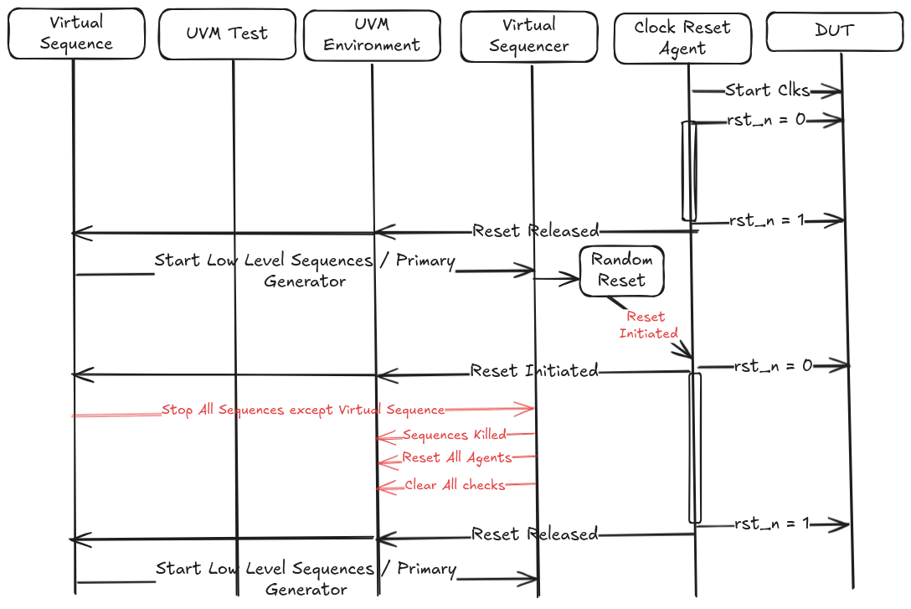

# Reset Management in Design Verification Testbenches

Author(s): [Yogish Sekhar](mailto:ycsekhar@zerorisc.com)
Reviewers: [Quan Nguyen](mailto:qmn@zerorisc.com), [Guillermo Maturana](mailto:matute@zerorisc.com)
Last Updated: March 27, 2026

**TL;DR:**
This document outlines standard practices, do's, and don'ts for effective reset management in verification testbenches employing Universal Verification Methodology in SV-UVM or pyUVM testbenches.
Proper reset handling is crucial for reliable testbench operation, accurate DUT (Design Under Test) initialization, and efficient debug.

# Introduction

Resets are fundamental to hardware design, bringing the DUT to a known initial state.
In a testbench, managing resets correctly is paramount to ensure verification components (sequences, drivers, monitors, scoreboards, etc.) behave predictably during and after reset assertion/deassertion.
This RFC aims to standardize reset handling to improve testbench robustness, reusability, and debuggability.

## Problem Statement
Testbenches often involve intricate reset scenarios, such as power-on resets, software-initiated resets, or partial resets in multi-domain systems.
Inconsistent handling of resets can lead to simulation artifacts, race conditions, or unverifiable states.

Some problems due to incorrect reset management include:
* Lack of standardized reset coordination mechanisms
* Race conditions between reset deassertion and test stimulus
* Inconsistent reset handling across different verification components

# Goals
This RFC outlines best practices for reset assertion, de-assertion, sequencing, and synchronization within the UVM framework:
* A unified reset management framework for UVM testbenches
  * Making reset testing easy, so developers don't avoid it
  * Making reset sequencing a first-class consideration from the beginning
* Standard interface and protocol for reset implementation and coordination
  * Improve mechanisms to allow complex interactions between different reset domains
* Separate clk and reset component per reset domain

# Standard Practices for Reset Management

## Centralized Reset Control

**Single Source of Truth:** A testbench should have a single, well-defined point for controlling, asserting, and deasserting the DUT's reset signal(s).
This is typically part of the base_test or a dedicated base_seq for the block.

**Hierarchical Propagation:** Reset control flows from the virtual sequence through the sequencer stack to the reset agent and ultimately the reset driver, which drives the DUT's reset pins.
All testbench elements should then synchronize with either the reset interface (drivers/monitors--at a pin level) or the reset monitor (all other components--at a transaction level) to ascertain the state of reset in the testbench and respond when reset is triggered.

## Synchronous vs. Asynchronous Resets

* Assertion of reset (going active) should occur immediately, without waiting for the clock edge.
* De-assertion (release) synchronized to the rising edge of the clock to prevent metastability.

**Understand DUT Behavior:** Clearly understand whether the DUT's reset is synchronous or asynchronous, and whether it's active-high or active-low.
Pick one polarity and stick to it consistently everywhere, e.g. use rst\_n (active-low) for DUT and testbench.

The testbench reset mechanism must accurately mimic this behavior.

**Clock-Gated Resets:** If the DUT uses clock-gated resets, ensure the testbench models this correctly, accounting for potential setup and hold violations during reset deassertion.
Note: this concern is primarily relevant in the context of gate-level simulation with timing.

**Global vs. Local resets:**

* Global reset: whole-chip/system reset (e.g. power-on).
* Local resets: block/module-level resets.
  Use only if DUT has isolated reset domains.

## Reset-Aware Components

**Drivers:** Drivers must be reset aware (at the pin level).
It has to wait for the DUT to come out of reset before sending transactions.
When a reset is seen, a driver should clear any pending transactions and return to a clean state.

**Monitors:** Monitors should also be reset-aware (at a pin level).
When a monitor sees the assertion of reset signal it should clear out any active data collection and return to a clean state.
It should then re-synchronize with the DUT after reset deassertion to restart interface sampling and transaction sampling.

**Synchronization and Metastability:** In most cases, a monitor is associated with a single reset domain and that reset deasserts synchronously with respect to the domain's clock — no special synchronization logic is needed.
However, if a reset input crosses clock domains asynchronously, monitors must include logic equivalent to a dual-flop synchronizer and must not directly sample asynchronous deassertion.
Clearly document whether each reset is synchronous or asynchronous with respect to the domain's clock.

**Scoreboards/Checkers:** Scoreboards and checkers should clear their expected and actual data models during reset to avoid false mismatches.
The preferred method for connecting the scoreboard to the reset monitor is analysis ports, however callbacks can also be used.
(The recommendations are specific to UVM methodology.)

**Sequences:** Resets should only be driven from the virtual sequence.
When reset is active no secondary sequences should be active or attempt to generate any transactions.
During normal test execution, when a reset is triggered randomly, the virtual sequence should wait until it is clear that reset is issued to the DUT and then terminate all secondary sequences; it restarts execution only when the DUT is out of reset and stable.

**Virtual Sequences:** Virtual sequences should coordinate reset application across multiple agents or if the DUT has multiple reset domains.

**Coverage & Checks:**

* Cover "reset asserted" event.
* Cover "reset de-assert coincident with X line" if DUT has timing dependencies.

**Self-checking:** After de-assert, verify that all DUT registers have their default values.
This can be randomized such that not every test needs to bear the overhead.

**Exceptions:** OTP, Flash, and ReRAMs need to prove they are nonvolatile and may also have other functionality to verify at the point of reset de-assertion.
The approach depends on the memory type and individual block test plans will need to have a section to verify any special behaviour that is exercised when reset testing is enabled.

## Reset Sequence

**Common Reset Sequence:** Should be a generic sequence that all testbenches can use to drive reset.
It is transaction driven: for example, a reset transaction is created in the reset sequence and sent down via the sequencer stack like any other transaction.

It should have the following control knobs:
* Assert-time duration
* Randomized delays post de-assert (optional): a small random delay after reset can be used to expose corner-cases, but should not be the default — in most cases the DUT should be able to handle transactions as soon as reset deasserts
* Clock alignment: always align reset de-assert to clock edge
* Pulse width: ensure reset pulse is not less than the minimum cycles required by the DUT spec

**Driver/Monitor functionality during Reset:** Drivers and monitors should have specific internal logic that is executed during reset, such as clearing internal FIFOs, state machines, or transaction queues.

**Test-Specific Resets:** Allow for execution of test-specific reset sequences if necessary (e.g. asserting reset mid-test for specific error injection scenarios), but these should build upon the standard reset mechanism.

**Execution of Reset Sequence:** Incorporate a dedicated reset sequence invocation at the beginning of every test.
This should:
* Assert reset for a specified duration.
* Deassert reset.
* Optionally wait a small random number of clock cycles post-deassertion to expose corner-cases; in most cases the DUT is ready to accept transactions immediately after deassertion.

## Clocks and Reset Relationship

**Stable Clock during Reset:** Ensure that the clock each reset is synchronous to at deassertion is running during reset assertion and before deassertion.
Reset should generally not be tied to the clock enable.

# Recommendations

## Things to Do

* Use a dedicated Reset Sequence and dedicated Reset Agent to manage Resets in a testbench.
  Avoid ad-hoc initial blocks in driver or top-level of the testbench.
  * Use the UVM phases (build\_phase, connect\_phase, end\_of\_elaboration\_phase, start\_of\_simulation\_phase, run\_phase, etc.) to manage testbench component initialization and reset application.
    Typically, the actual reset assertion/deassertion occurs at the very beginning of the run\_phase or within a sequence started in run\_phase.
  * Ensure that all testbench components (agents, models, scoreboards, etc.) have a mechanism to reset their internal state.
    This can be achieved through:
    * A dedicated reset() function/task called for structural elements (drivers / monitors) when reset is invoked.
  * Listening to the reset signal directly via a dedicated reset virtual interface.
    * Use a virtual interface (vif\_proxy) for the reset signal to provide a clean, abstract way for testbench components to monitor the reset.
* Parameterize reset timing (pulse width, delay) so different tests can override.
* Synchronize de-assertion to clock--never use a delayed assignment.
* Randomize reset skew (within DUT spec) to catch corner cases. (Note: this is primarily relevant in the context of gate-level simulation with timing.)
* Include post-reset functional checks in scoreboards.
  * These are usually triggered by sequences doing access to CSRs.
  * Explicit CSR tests need to readback all registers just after reset.
* When reset is observed during operational testcases, readback of registers is not always required, but tests have to restart.
  If changes were observed in non-volatile memories like Flash or ReRAMs, verify the state is correct using the shadow memory model as the reference.
* Collect reset coverage in block or top level functional coverage plan.

## Things to Avoid

* Release reset inside an initial block in testbench components.
* Assert reset for an arbitrary duration.
  The duration should be based on the DUT's specification and allow for proper internal reset propagation.
* Drive reset from multiple sources.
  * Let agents or components directly toggle the DUT's top-level reset signal independently.
    Centralize this control.
* Leave reset polarity ambiguous--always name it clearly (rst\_n vs. rst).
* Use hardcoded time delays (\#10ns) in testbench for reset sequencing.
* Don't forget to disable or clean up your ResetGen in the final\_phase or when starting a new test.
* Use $random or any other non-deterministic initialization for components after reset.
  Ensure all components are brought to a known, deterministic state.
* Neglect the impact of reset on verification IP (VIP) or third-party models.
  Ensure they are also properly reset and synchronized.
* Forget to verify what happens if reset is asserted during an ongoing transaction or in unusual corner cases.
* Assume the DUT is in a clean state just because reset was asserted.
  Always perform post-reset checks (there are overheads here that need to be considered).

# Future Topics / Explorations
* Multi-Domain Support

# Additional Reading
* [Building Scalable UVM Testbenches](../../doc/contributing/dv/methodology/building_scalable_system_verilog_uvm_infrastructure_for_open_silicon_ips.md)
* [Porting_Guide](../../doc/contributing/dv/methodology/pavona_reset_safe_porting_guide.md)
